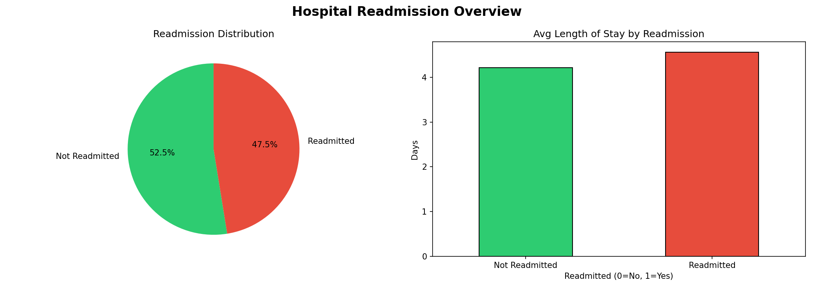
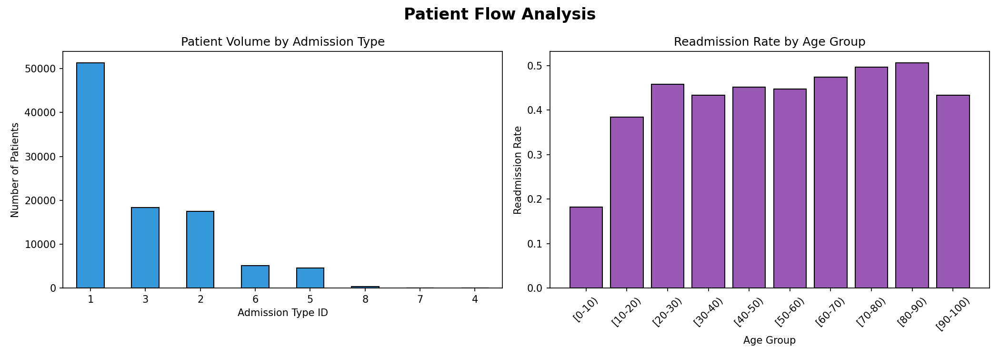
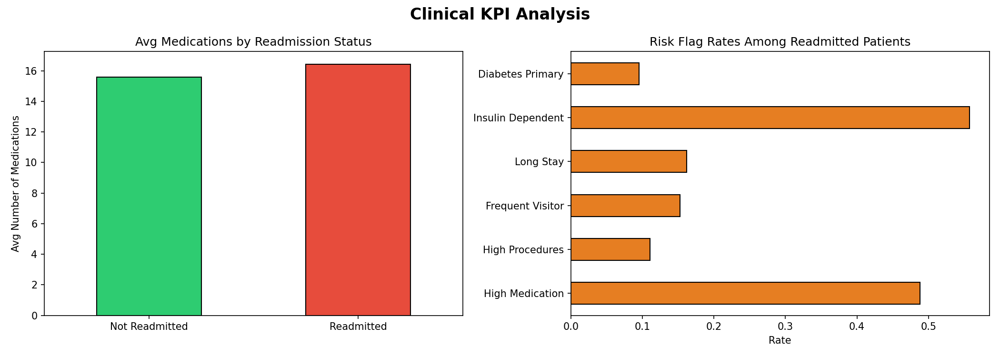
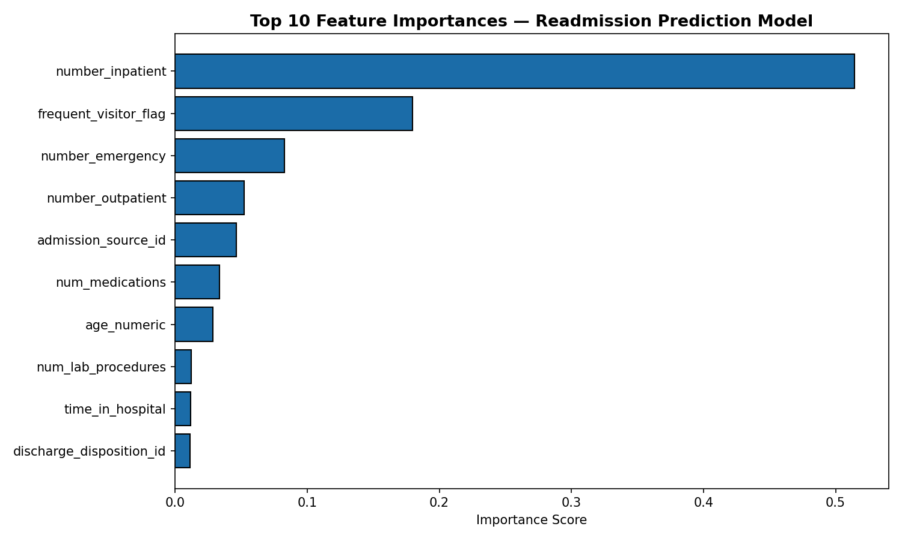
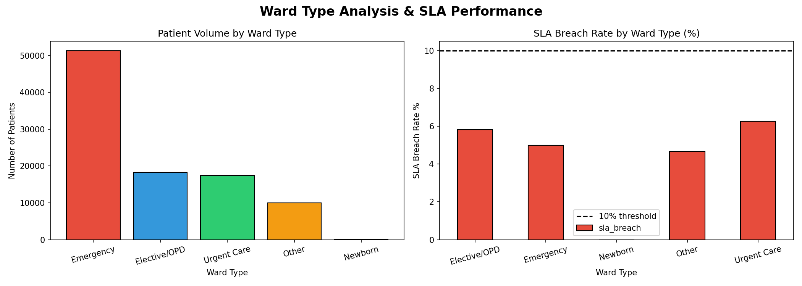
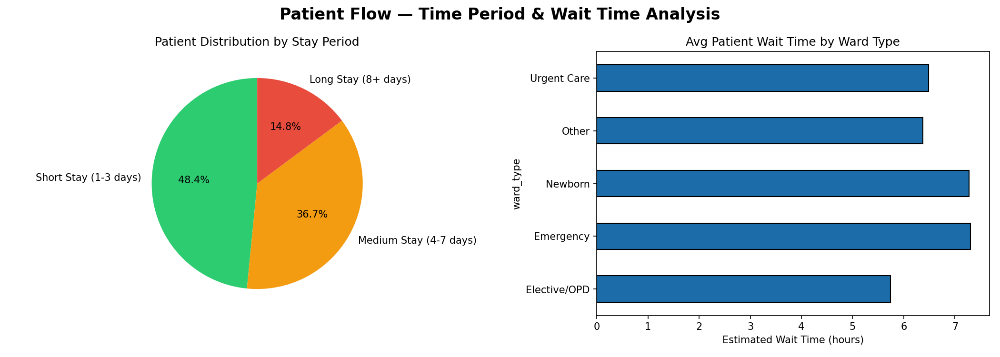
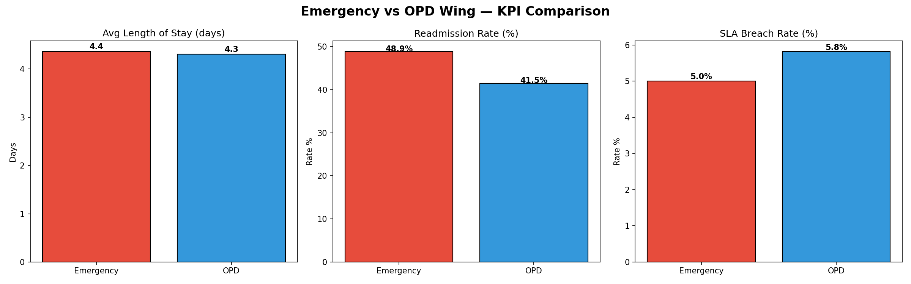

# 🏥 Hospital Operations & Patient Readmission Prediction
> End-to-end Data + AI system built on Databricks | Medallion Architecture | MLflow | RandomForest Classifier


---

## 📌 Problem Statement

Hospital readmissions within 30 days are a critical operational, clinical, and financial challenge. 
This project builds a **complete end-to-end Data + AI pipeline** to:

- Analyse patient flow, ward-level KPIs, SLA breaches, and operational bottlenecks
- Predict which patients are at **high risk of readmission** before discharge
- Support hospital administrators with actionable dashboards and executive reports
- Simulate NABH-aligned operational metrics across Emergency and OPD wings

---

## 📊 Dataset

| Property | Detail |
|---|---|
| Source | Diabetes 130-US Hospitals (Kaggle) |
| Records | 101,766 patient encounters |
| Features | 50 columns |
| Target | Readmission status (<30 days, >30 days, No readmission) |
| Volume Path | `/Volumes/workspace/default/hospital_operations_ai/diabetic_data.csv` |

---

## 🏗️ Architecture — Medallion Pipeline
```
RAW CSV (Kaggle Dataset)
        ↓
🥉 BRONZE LAYER
   Raw ingestion → Delta table
   No transformations, preserves source fidelity
        ↓
🥈 SILVER LAYER
   Null handling → Duplicate removal → Encoding
   Discharge filter → Age normalization → Binary target
        ↓
🥇 GOLD LAYER
   Feature Engineering → KPI Aggregations
   Ward Mapping → SLA Flags → Wait Time Estimation
   Bed Occupancy → Peak Load → Emergency/OPD Split
        ↓
🤖 ML MODEL
   RandomForest V1 + V2 → MLflow Tracking
   Predictions saved back to Gold layer
        ↓
📊 DASHBOARD
   7 Visualization Charts → 14 KPI Summary
```

---

## 📁 Project Structure
```
hospital-operations-ai/
│
├── 01_Bronze_Ingestion.ipynb           # Raw CSV → Bronze Delta table
├── 02_Silver_Transformation.ipynb      # Cleaning, encoding, null handling
├── 03_Gold_Feature_Engineering.ipynb   # KPIs, features, ward mapping
├── 04_ML_Readmission_Prediction.ipynb  # RandomForest + MLflow tracking
├── 05_Dashboard_Visualizations.ipynb   # 7 charts + KPI summary
│
├── chart1_overview.png                 # Readmission distribution & ALOS
├── chart2_patient_flow.png             # Admission types & age groups
├── chart3_kpis.png                     # Medication load & risk flags
├── chart4_feature_importance.png       # ML model top predictors
├── chart5_ward_sla.png                 # Ward volume & SLA breach rates
├── chart6_timeperiod_waittime.png      # Stay period & wait time analysis
├── chart7_emergency_opd.png            # Emergency vs OPD KPI comparison
│
└── README.md
```

---

## ⚙️ Setup & Requirements

### Prerequisites
- Databricks Community Edition (Runtime **13.3 LTS**, Scala 2.12, Spark 3.4)
- Unity Catalog Volume created at `/Volumes/workspace/default/hospital_operations_ai/`
- Dataset uploaded as `diabetic_data.csv` inside the volume

### Libraries Used
```
pyspark
mlflow
pandas
matplotlib
numpy
```
All libraries are pre-installed on Databricks Community Edition — no additional installs needed.

### Run Order
```
1. 01_Bronze_Ingestion
2. 02_Silver_Transformation
3. 03_Gold_Feature_Engineering
4. 04_ML_Readmission_Prediction
5. 05_Dashboard_Visualizations
```
> ⚠️ Run notebooks strictly in order. Each notebook reads Delta tables created by the previous one.

---

## 🥈 Silver Layer — Data Cleaning

| Transformation | Detail |
|---|---|
| Null handling | Dropped `weight`, `payer_code`, `medical_specialty` (>40% null) |
| Duplicate removal | Deduplicated on `encounter_id` |
| Discharge filter | Removed expired/hospice discharges (IDs 11,13,14,19,20,21) |
| Age normalization | Extracted numeric lower bound from age range string |
| Target encoding | `readmitted` → binary (0 = No, 1 = <30 or >30 days) |
| Gender cleaning | Removed `Unknown/Invalid` gender records |

**Silver row count: ~97,000 records**

---

## 🥇 Gold Layer — Feature Engineering

### Engineered Features

| Feature | Logic | Purpose |
|---|---|---|
| `high_medication_flag` | `num_medications > 15` | High medication burden |
| `high_procedures_flag` | `num_procedures > 3` | Complex procedure cases |
| `frequent_visitor_flag` | combined prior visits > 3 | Chronic/repeat patients |
| `long_stay_flag` | `time_in_hospital > 7` | Extended admission cases |
| `insulin_flag` | Insulin = Steady/Up/Down | Active insulin management |
| `diabetes_primary_flag` | `diag_1` starts with 250 | Primary diabetes diagnosis |
| `estimated_wait_time` | lab × 0.15 + procedures × 0.25 | Simulated wait time |
| `ward_type` | Mapped from `admission_type_id` | Ward classification |
| `stay_period` | Short/Medium/Long stay buckets | Time period segmentation |
| `sla_breach` | `time_in_hospital > 10` | SLA violation flag |

### Ward Type Mapping

| Admission Type ID | Ward Type |
|---|---|
| 1 | Emergency |
| 2 | Urgent Care |
| 3 | Elective / OPD |
| 4 | Newborn |
| 5+ | Other |

---

## 📊 14 KPIs Tracked

| # | KPI | Scope |
|---|---|---|
| 1 | Readmission Rate (%) | Overall |
| 2 | Average Length of Stay — ALOS (days) | Overall |
| 3 | Bed Occupancy Rate — Emergency (%) | Emergency Wing |
| 4 | Bed Occupancy Rate — OPD (%) | OPD Wing |
| 5 | Avg Patient Wait Time (hrs) | Overall |
| 6 | SLA Breach Rate — Overall (%) | Overall |
| 7 | SLA Breach Rate — Emergency (%) | Emergency Wing |
| 8 | SLA Breach Rate — OPD (%) | OPD Wing |
| 9 | Peak Load Ward | Overall |
| 10 | Department Throughput | By Admission Type |
| 11 | Readmission Rate by Ward Type | By Ward |
| 12 | Avg Medications per Patient | Overall |
| 13 | High Risk Patient Rate (%) | Overall |
| 14 | Model Prediction AUC | ML Layer |

---

## 🤖 ML Model — Patient Readmission Risk Prediction

### Model Comparison (MLflow Tracked)

| Parameter | V1 | V2 Tuned |
|---|---|---|
| Algorithm | RandomForest | RandomForest |
| Number of Trees | 100 | 200 |
| Max Depth | 6 | 8 |
| Min Instances Per Node | default | 5 |
| **AUC** | 0.6699 | **0.6742** ✅ |
| **Accuracy** | 0.6248 | **0.6287** ✅ |
| **F1 Score** | 0.6193 | **0.6225** ✅ |

Both runs tracked, logged, and versioned in **MLflow Experiments**.

### Top 3 Predictors

| Rank | Feature | Importance |
|---|---|---|
| 1 | `number_inpatient` | 0.514 |
| 2 | `frequent_visitor_flag` | 0.180 |
| 3 | `number_emergency` | 0.083 |

> Prior hospitalizations dominate readmission risk — patients with 3+ prior inpatient visits are highest priority for intervention.

---

## 📈 Dashboard Visualizations

| Chart | Description |
|---|---|
|  | Readmission distribution & avg length of stay |
|  | Admission type volumes & age-group readmission rates |
|  | Medication load & engineered risk flag analysis |
|  | Top 10 ML model feature importances |
|  | Ward type patient volume & SLA breach rates |
|  | Stay period distribution & wait time by ward |
|  | Emergency vs OPD — ALOS, Readmission & SLA comparison |

---

## 🗄️ Delta Lake Implementation

| Practice | Implementation |
|---|---|
| Delta format | All tables saved as Delta |
| ACID transactions | write/overwrite with schema enforcement |
| Schema evolution | `overwriteSchema = true` used where needed |
| Table optimization | `OPTIMIZE` + `ZORDER BY (readmitted_binary, age_numeric)` |
| Unity Catalog | All tables registered under `workspace.default` |
| Gold tables created | `gold_hospital_features`, `gold_bed_occupancy`, `gold_peak_load`, `gold_predictions`, `gold_dept_summary` |

---

## 💡 Business Impact

**For Hospital Administrators:**
- Identify high-risk patients before discharge for targeted follow-up care
- Monitor SLA breaches in real time across Emergency and OPD wings
- Track bed occupancy and plan ward-level resource allocation

**For Clinical Teams:**
- Flag patients on high medication loads or frequent prior admissions
- Monitor department throughput and peak load periods
- Support NABH audit readiness with compliance-aligned KPIs

**For Management:**
- Executive KPI dashboard with 14 tracked metrics
- Data-backed staffing coordination recommendations
- Reduce 30-day readmission penalties through early risk detection

---

## 🔄 ML Pipeline Integration
```
Gold Delta Table (gold_hospital_features)
        ↓
Feature Selection (17 features)
        ↓
VectorAssembler → Feature Vector
        ↓
Train/Test Split (80/20, seed=42)
        ↓
RandomForest Training (V1 → V2)
        ↓
MLflow Logging (params + metrics + model)
        ↓
Predictions → gold_predictions (Delta)
```

---

## 👩‍💻 Author

**Dhakshitha Herculin C**

[](https://linkedin.com/in/dhakshitha-herculin-c-042718172)
[](https://github.com/dhakshi128)

---

## 📄 License
This project is built for educational and portfolio purposes.
Dataset sourced from Kaggle — Diabetes 130-US Hospitals dataset.
